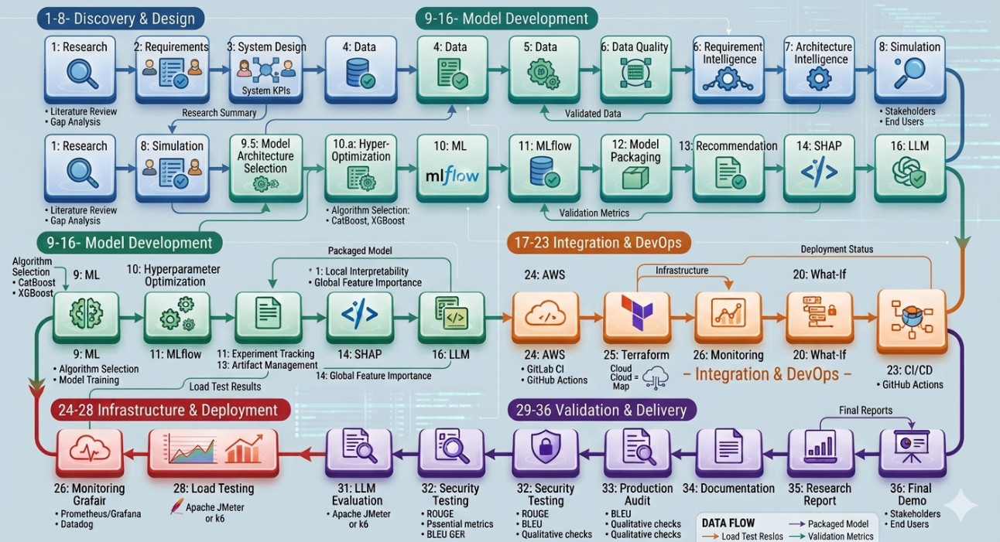

# AI-Powered Architecture Decision Intelligence Platform (ADIP)

> **Research + Industry Project:** An AI-powered platform for evaluating software architecture alternatives using requirements, architecture graphs, simulation, machine learning, multi-objective optimization, explainable AI, RAG, and LLM-based decision support.

---

## 1. Project Overview

Software architecture decisions such as:

- Monolith vs. Microservices
- PostgreSQL vs. MongoDB
- Redis vs. No Cache
- REST vs. GraphQL
- Kafka/Event-Driven vs. Request-Response
- Kubernetes vs. VMs

are often made using experience, intuition, or simplified rules.

ADIP aims to make these decisions **evidence-driven and measurable**.

The platform accepts structured or natural-language requirements such as:

- Expected users
- Request rate / RPS
- Peak traffic
- Concurrency
- Data size
- Read/write ratio
- Latency SLA
- Availability SLA
- Budget
- Team size
- Release frequency
- Traffic growth

It then represents candidate architectures, estimates their behavior, simulates workloads, predicts quality attributes, explains the predictions, and produces a transparent architecture comparison.

### Core predicted / evaluated attributes

- Latency
- Throughput
- CPU utilization
- Memory utilization
- Scalability
- Infrastructure cost
- Reliability / availability-related behavior
- Maintainability-related architectural characteristics

> **Important research principle:** ADIP separates observed/production data, benchmark data, controlled experimental data, simulated data, and synthetic data. Synthetic or simulated observations must never be presented as real-world ground truth.

---

# 2. Problem Statement

Existing architecture/design tools such as diagramming and UML tools primarily help teams **draw and document** architectures.

They generally do not answer questions such as:

> "Given these requirements, what happens to latency, throughput, infrastructure cost, resource utilization, and scalability if I choose Architecture A instead of Architecture B?"

ADIP addresses this gap by connecting:

```text
Requirements
     ↓
Architecture Alternatives
     ↓
Architecture Graph
     ↓
Workload + Resource Configuration
     ↓
Simulation / Benchmark Evidence
     ↓
ML Prediction
     ↓
Explainability
     ↓
Multi-Objective Recommendation
     ↓
RAG + LLM Explanation
     ↓
Architecture Decision
```

---

# 3. Objectives

## Primary Objectives

1. Convert natural-language/system requirements into structured engineering constraints.
2. Represent software architectures as machine-readable graphs.
3. Integrate heterogeneous architecture and performance datasets.
4. Build a reproducible architecture-performance dataset.
5. Simulate workloads and architecture behavior.
6. Train ML models to predict performance and resource metrics.
7. Optimize model hyperparameters and track model lifecycle.
8. Compare architecture alternatives using multi-objective optimization.
9. Explain predictions using SHAP.
10. Ground architecture explanations using RAG.
11. Provide an LLM-based architecture advisor.
12. Support what-if analysis.
13. Validate predictions against benchmark and controlled experimental observations.
14. Deploy and monitor the complete platform.

---

# 4. Key Research Contributions

ADIP is designed around the following research contributions:

### 4.1 Heterogeneous Architecture-Performance Dataset

There is no single ideal public dataset containing:

```text
Requirements
+
Architecture
+
Workload
+
Resources
+
Latency
+
Throughput
+
Cost
+
Reliability
```

Therefore ADIP constructs a provenance-aware dataset from multiple sources.

### 4.2 Architecture-to-Performance Modeling

The project investigates relationships between:

```text
Architecture + Workload + Infrastructure
                ↓
      Performance / Resource Metrics
```

### 4.3 Simulation + ML

Simulation is used to explore scenarios that are not sufficiently represented in public datasets, while ML learns patterns from observed/benchmark/experimental data.

### 4.4 Multi-Objective Architecture Recommendation

Architecture decisions rarely optimize a single metric.

ADIP considers trade-offs between:

```text
Latency
Throughput
Cost
Scalability
Reliability
Resource Utilization
```

using Pareto analysis and TOPSIS.

### 4.5 Explainable Architecture Intelligence

Predictions should not be black boxes.

SHAP is used to identify which features contributed to predictions.

### 4.6 Evidence-Grounded LLM Advisor

The LLM is not intended to invent architecture knowledge. It retrieves relevant evidence from a curated knowledge base using RAG and generates explanations grounded in retrieved sources.

---

# 5. High-Level Architecture

```text
                         ┌─────────────────────┐
                         │      User / Team     │
                         └──────────┬──────────┘
                                    │
                                    ▼
                         ┌─────────────────────┐
                         │ Requirement         │
                         │ Intelligence        │
                         └──────────┬──────────┘
                                    │
                                    ▼
                         ┌─────────────────────┐
                         │ Architecture        │
                         │ Intelligence        │
                         │ React Flow + Graph   │
                         └──────────┬──────────┘
                                    │
                    ┌───────────────┼───────────────┐
                    ▼               ▼               ▼
              Workload Data   Architecture Data  Pricing
                    │               │               │
                    └───────────────┼───────────────┘
                                    ▼
                         ┌─────────────────────┐
                         │ Simulation Engine   │
                         │ SimPy + NumPy/SciPy │
                         └──────────┬──────────┘
                                    │
                                    ▼
                         ┌─────────────────────┐
                         │ ML Prediction       │
                         │ XGBoost / sklearn    │
                         └──────────┬──────────┘
                                    │
                    ┌───────────────┼───────────────┐
                    ▼               ▼               ▼
              SHAP Explainability  What-if     Recommendation
                                    │          TOPSIS/Pareto
                                    │               │
                                    └───────┬───────┘
                                            ▼
                                  ┌──────────────────┐
                                  │ RAG Knowledge     │
                                  │ Base + pgvector   │
                                  └────────┬─────────┘
                                           ▼
                                  ┌──────────────────┐
                                  │ LLM Architecture │
                                  │ Advisor           │
                                  └────────┬─────────┘
                                           ▼
                                  Architecture Report
```

---

# 6. Technology Stack

| Component | Technology |
|---|---|
| Requirement Intelligence | Python, OpenAI, Pydantic |
| Architecture Intelligence | NetworkX, React Flow, PostgreSQL |
| Simulation | SimPy, NumPy, SciPy |
| ML | Scikit-learn, XGBoost |
| Experiment Tracking | MLflow |
| Recommendation | SciPy, TOPSIS, Pareto |
| Explainability | SHAP |
| RAG | PostgreSQL + pgvector |
| LLM | OpenAI |
| Frontend | React, TypeScript, Tailwind CSS, React Flow, Recharts |
| Backend | FastAPI, Pydantic |
| Cache | Redis |
| Testing | Pytest, Jest |
| Packaging | Docker |
| Deployment | AWS, Docker |
| Infrastructure as Code | Terraform |
| Monitoring | Prometheus, Grafana |
| Version Control | Git + GitHub |

---

# 7. Data Strategy

ADIP does not rely on one dataset.

The project uses a **multi-source data strategy**.

## 7.1 Existing Raw Data Sources & Resource Links

| # | Source | Data Type | Primary Use | Link / Repository |
|---|---|---|---|---|
| 1 | Zenodo Microservices Benchmark | Experimental benchmark | CPU, RAM, concurrency, latency | [zenodo.org/records/6907619](https://zenodo.org/records/6907619) |
| 2 | Alibaba Cluster Trace | Production trace | Microservice call graphs, call rate, response time, resource utilization | [alibaba/clusterdata (v2021)](https://github.com/alibaba/clusterdata/tree/master/cluster-trace-microservices-v2021) |
| 3 | TechEmpower FrameworkBenchmarks | Web benchmark | Framework/application throughput and performance | [TechEmpower/FrameworkBenchmarks](https://github.com/TechEmpower/FrameworkBenchmarks) |
| 4 | Barista Benchmarks | Microservice benchmark | Throughput, latency, CPU, memory, startup behavior | [barista-benchmarks/barista](https://github.com/barista-benchmarks/barista) |
| 5 | Software-Architecture Dataset | Text/Q&A | Architecture knowledge, RAG | [ajibawa-2023/Software-Architecture](https://huggingface.co/datasets/ajibawa-2023/Software-Architecture) |
| 6 | Technical-Architectures-Large | Synthetic architecture/graph | Architecture structures, styles, constraints, graph representation | [ajibawa-2023/Technical-Architectures-Large](https://huggingface.co/datasets/ajibawa-2023/Technical-Architectures-Large) |
| 7 | YCSB | Database workload/benchmark | Read/write workloads, DB latency and throughput | [brianfrankcooper/YCSB](https://github.com/brianfrankcooper/YCSB) |
| 8 | TPC Benchmarks | Standardized DB/transaction benchmarks | Transaction/database performance validation | [tpc.org/benchmarks5.asp](https://www.tpc.org/information/benchmarks5.asp) |
| 9 | AWS Price List API | Pricing | Infrastructure cost modeling | [AWS Price List API Docs](https://docs.aws.amazon.com/aws-cost-management/latest/APIReference/Welcome.html) |
| 10 | DeathStarBench | End-to-end microservice benchmark | Distributed application performance and architecture experiments | [delimitrou/DeathStarBench](https://github.com/delimitrou/DeathStarBench) |
| 11 | Train-Ticket | End-to-end microservice application | Microservice graphs, database/deployment experiments, load/failure testing | [FudanSELab/train-ticket](https://github.com/FudanSELab/train-ticket) |
| 12 | OpenTelemetry Demo | Observable microservice application | Traces, metrics, service dependencies, observability | [open-telemetry/opentelemetry-demo](https://github.com/open-telemetry/opentelemetry-demo) |
| 13 | Google Online Boutique | Cloud-native microservices | Controlled experiments, Kubernetes, gRPC, Redis, load testing | [GoogleCloudPlatform/microservices-demo](https://github.com/GoogleCloudPlatform/microservices-demo) |

---

# 8. Data Categories

Raw sources should not be treated as one homogeneous dataset.

## A. Production / Real-World Trace Data

Example:

```text
Alibaba Cluster Trace
```

Used to study real microservice runtime behavior.

## B. Controlled Benchmark Data

Examples:

```text
Zenodo
Barista
TechEmpower
YCSB
TPC
```

Used for measurable performance relationships.

## C. Architecture Specification Data

Examples:

```text
Technical-Architectures-Large
DeathStarBench
Train-Ticket
Online Boutique
OpenTelemetry Demo
```

Used for architecture representation and controlled experiments.

## D. Knowledge / Text Data

Examples:

```text
Software-Architecture
Research Papers
Architecture Documentation
Cloud Documentation
Benchmark Documentation
```

Used primarily for RAG and LLM grounding.

## E. ADIP-Generated Data

```text
Controlled Experiments
Simulation Data
```

Generated by the project to fill gaps between architecture configuration and measurable outcomes.

---

# 9. Data Provenance

Every processed record should preserve provenance.

Recommended metadata:

```text
source_dataset
source_record_id
source_type
experiment_id
architecture_id
workload_id
is_real
is_benchmark
is_simulated
is_synthetic
collection_timestamp
processing_version
```

Example:

```text
source_dataset = Alibaba
source_type = production_trace
is_real = true
is_benchmark = false
is_simulated = false
is_synthetic = false
```

Synthetic architecture data must not be treated as observed performance ground truth.

---

# 10. Dataset Pipeline

```text
Raw Data
   ↓
Data Ingestion
   ↓
Source Validation
   ↓
Data Cleaning
   ↓
Schema Normalization
   ↓
Duplicate Detection
   ↓
Missing Value Analysis
   ↓
Outlier Analysis
   ↓
Leakage Prevention
   ↓
Feature Engineering
   ↓
Architecture Graph Extraction
   ↓
Workload Normalization
   ↓
Dataset Integration
   ↓
Train / Validation / Test Split
   ↓
Final ML Dataset
```

---

# 11. Proposed Dataset Schema

ADIP should maintain multiple related datasets rather than one giant CSV.

## 11.1 Requirements Dataset

```text
project_id
domain
expected_users
concurrent_users
rps
peak_rps
traffic_growth_rate
data_size
read_write_ratio
latency_sla
availability_sla
budget
team_size
release_frequency
```

## 11.2 Architecture Configuration Dataset

```text
architecture_id
architecture_pattern
architecture_style
service_count
database_type
database_count
cache_type
cache_enabled
messaging_type
message_queue_count
api_style
api_gateway
load_balancer
service_mesh
deployment_type
cloud_provider
region
containerized
orchestration
replica_count
cpu_limit
memory_limit
architecture_complexity
node_count
edge_count
```

## 11.3 Workload Dataset

```text
workload_id
rps
peak_rps
concurrency
read_write_ratio
data_size
request_size
request_type
workload_pattern
traffic_pattern
```

## 11.4 Performance Observation Dataset

```text
experiment_id
architecture_id
workload_id

cpu_utilization
memory_utilization

latency_p50
latency_p75
latency_p90
latency_p95
latency_p99
latency_p999

throughput
error_rate

database_latency
database_cpu
database_memory

cache_hit_rate
network_latency
network_overhead
startup_time
availability
```

## 11.5 Cost Dataset

```text
architecture_id
cloud_provider
region
service
instance_type
instance_count
storage
network
compute_cost
database_cost
cache_cost
load_balancer_cost
data_transfer_cost
monthly_cost
pricing_timestamp
```

---

# 12. ML Targets

ADIP should use multiple prediction models rather than one universal model.

### Model 1 — Latency

```text
Input:
Architecture + Workload + Resources

Target:
p95 / p99 latency
```

### Model 2 — Throughput

```text
Input:
Architecture + Workload + Resources

Target:
throughput
```

### Model 3 — Resource Utilization

```text
Input:
Architecture + Workload

Target:
CPU utilization
Memory utilization
```

### Model 4 — Cost

```text
Input:
Architecture + Required Resources + Cloud Pricing

Target:
monthly infrastructure cost
```

### Model 5 — Reliability / Availability

```text
Input:
Architecture + Replication + Dependencies + Failure Conditions

Target:
availability / failure-related metrics
```

Reliability labels must be supported by actual measurements or carefully defined simulation outcomes.

---

# 13. Feature Engineering

Potential architecture features:

```text
service_count
database_count
cache_enabled
message_queue_count
replica_count
node_count
edge_count
graph_depth
average_degree
max_degree
fan_in
fan_out
critical_path_length
architecture_complexity
```

Potential workload features:

```text
rps
peak_rps
concurrency
data_size
read_write_ratio
request_size
traffic_growth_rate
```

Potential infrastructure features:

```text
cpu_limit
memory_limit
instance_count
instance_type
cloud_provider
region
deployment_type
```

Potential derived features:

```text
requests_per_service
dependency_density
resource_per_request
estimated_monthly_cost
cache_to_request_ratio
```

---

# 14. Architecture Graph Representation

Architecture diagrams should be converted into machine-readable graphs.

Example:

```text
Frontend
   ↓
API Gateway
   ↓
Order Service
   ├── Redis
   ├── PostgreSQL
   └── Kafka
```

NetworkX representation:

```python
G.add_node("frontend", type="client")
G.add_node("gateway", type="api_gateway")
G.add_node("order_service", type="service")
G.add_node("redis", type="cache")
G.add_node("postgres", type="database")
G.add_node("kafka", type="message_broker")

G.add_edge("frontend", "gateway", communication="HTTP")
G.add_edge("gateway", "order_service", communication="HTTP")
G.add_edge("order_service", "redis", communication="TCP")
G.add_edge("order_service", "postgres", communication="TCP")
G.add_edge("order_service", "kafka", communication="async")
```

This enables graph-based feature extraction.

---

# 15. Simulation Engine

The simulation engine uses:

- SimPy
- NumPy
- SciPy

Potential simulation variables:

```text
arrival rate
service rate
queue length
concurrency
network delay
database delay
cache hit rate
service dependency
replica count
failure probability
```

Example:

```text
Request Arrival
      ↓
API Gateway
      ↓
Service Queue
      ↓
Database / Cache / Broker
      ↓
Response
```

The simulator should be reproducible using controlled seeds and documented assumptions.

---

# 16. ML Pipeline

```text
Unified Dataset
      ↓
Data Validation
      ↓
Train / Validation / Test Split
      ↓
Baseline Models
      ↓
Feature Engineering
      ↓
Model Training
      ↓
Hyperparameter Optimization
      ↓
Cross Validation
      ↓
Model Selection
      ↓
MLflow Tracking
      ↓
Model Registry
      ↓
Model Packaging
```

Candidate models:

- Linear Regression
- Random Forest
- Gradient Boosting
- XGBoost

XGBoost can be used as a primary candidate, but model selection should be based on measured validation performance rather than assuming one algorithm is always best.

---

# 17. Hyperparameter Optimization

Evaluate parameters such as:

```text
n_estimators
max_depth
learning_rate
subsample
colsample_bytree
min_child_weight
reg_alpha
reg_lambda
```

Use:

- Cross-validation
- Grid Search
- Random Search
- Bayesian optimization if justified

Track every experiment using MLflow.

---

# 18. MLflow / Model Lifecycle

```text
Experiment
   ↓
Training Run
   ↓
Metrics
   ↓
Artifacts
   ↓
Model Registry
   ↓
Validation
   ↓
Approved Model
   ↓
Packaged Model
   ↓
Deployment
```

Track:

```text
dataset_version
feature_version
model_version
hyperparameters
metrics
training_time
code_version
```

---

# 19. Recommendation Engine

ADIP should not reduce architecture selection to a single metric.

Example objectives:

```text
Minimize:
    latency
    cost
    resource utilization

Maximize:
    throughput
    scalability
    reliability
```

## Pareto Analysis

Identify architectures for which no other architecture is simultaneously better across all selected objectives.

## TOPSIS

Use normalized weighted criteria to calculate relative closeness to an ideal solution.

Weights should be user-configurable.

Example:

```text
Latency       35%
Cost          25%
Scalability   20%
Reliability   20%
```

The platform should show the underlying criteria and trade-offs instead of hiding them behind an opaque recommendation.

---

# 20. SHAP Explainability

For ML predictions, SHAP can answer:

```text
Why was predicted latency high?
```

Example:

```text
High RPS              → increased predicted latency
High concurrency      → increased predicted latency
Redis enabled         → reduced predicted latency
More replicas         → reduced predicted latency
High network hops     → increased predicted latency
```

The actual direction and magnitude must come from the trained model and evaluation data.

---

# 21. RAG Knowledge Base

The RAG layer should contain curated documents such as:

- Architecture patterns
- ADRs
- Benchmark documentation
- Cloud documentation
- Database documentation
- Kubernetes documentation
- Reliability/scalability guidance
- Research papers
- Technical reports
- Benchmark methodology
- Architecture design references

Pipeline:

```text
Documents
   ↓
Cleaning
   ↓
Chunking
   ↓
Metadata
   ↓
Embeddings
   ↓
pgvector
   ↓
Retriever
   ↓
Relevant Evidence
   ↓
LLM
```

Each retrieved document should preserve provenance.

---

# 22. LLM Architecture Advisor

The LLM should receive:

```text
User Requirements
+
Architecture Alternatives
+
ML Predictions
+
SHAP Explanations
+
Recommendation Trade-offs
+
Retrieved Evidence
```

It should generate:

- Architecture rationale
- Trade-off explanation
- Risk discussion
- Constraint violations
- Performance explanation
- Cost explanation
- Alternatives
- What-if interpretation
- Evidence references

The LLM should not fabricate benchmark results or unsupported claims.

---

# 23. What-If Analysis

The user should be able to change variables such as:

```text
RPS
Concurrency
Data size
Read/write ratio
CPU
Memory
Replica count
Database
Cache
Messaging
Cloud
```

Example:

```text
Current:
5,000 RPS
3 replicas
Redis enabled

What-if:
20,000 RPS
6 replicas
Redis enabled
```

The system recalculates:

```text
Predicted latency
Predicted throughput
CPU
Memory
Estimated cost
Trade-offs
```

---

# 24. Frontend

Main screens:

```text
Dashboard
│
├── Project Creation
├── Requirement Input
├── Architecture Builder
├── Architecture Comparison
├── Simulation Configuration
├── Prediction Dashboard
├── What-If Analysis
├── Recommendation View
├── SHAP Explanation
├── RAG / LLM Advisor
├── Experiment History
└── Model / Validation Results
```

Recommended visualization:

- Architecture graph
- Latency charts
- Throughput charts
- Cost charts
- Radar/criteria views where appropriate
- Pareto frontier
- SHAP plots
- What-if charts

---

# 25. Backend

FastAPI services can be organized as:

```text
/api/v1/projects
/api/v1/requirements
/api/v1/architectures
/api/v1/simulations
/api/v1/predictions
/api/v1/recommendations
/api/v1/explanations
/api/v1/rag
/api/v1/advisor
/api/v1/what-if
/api/v1/experiments
```

Backend responsibilities:

- Validation
- Authentication/authorization
- Database access
- Architecture graph processing
- Simulation orchestration
- ML inference
- Recommendation execution
- RAG retrieval
- LLM orchestration
- Audit logging

---

# 26. Database Design

PostgreSQL should store:

```text
users
projects
requirements
architectures
architecture_nodes
architecture_edges
workloads
experiments
predictions
recommendations
explanations
datasets
dataset_versions
model_versions
evaluation_results
documents
document_chunks
```

pgvector can store RAG embeddings.

Redis can be used for:

- Caching
- Session-related temporary state
- Expensive prediction results
- Job/status caching

---

# 27. Security

Security requirements include:

- Authentication
- Authorization / RBAC
- Input validation
- API security
- Secret management
- Secure LLM input handling
- Prompt injection defenses for RAG
- Document provenance
- Rate limiting
- Audit logging
- Secure Docker configuration
- Dependency scanning
- Infrastructure security

Never store API keys in source code.

Use environment variables or a secure secret-management mechanism.

---

# 28. Testing Strategy

## Unit Testing

Backend:

```text
pytest
```

Frontend:

```text
Jest
```

Test:

- Feature engineering
- Graph conversion
- Simulation components
- ML preprocessing
- Recommendation calculations
- API endpoints
- UI components

## Integration Testing

Test:

```text
Frontend
   ↓
FastAPI
   ↓
PostgreSQL
   ↓
ML
   ↓
Recommendation
   ↓
RAG/LLM
```

## End-to-End Testing

Test the complete workflow:

```text
Create Project
→ Enter Requirements
→ Build Architecture
→ Simulate
→ Predict
→ Compare
→ Explain
→ Recommend
→ Ask LLM Advisor
```

---

# 29. Load Testing

Use realistic workloads:

```text
1K RPS
5K RPS
10K RPS
25K RPS
50K RPS
```

where supported by the experimental environment.

Measure:

```text
p50
p95
p99
throughput
CPU
memory
error rate
database utilization
cache hit rate
network overhead
```

Do not claim that a benchmark at one workload generalizes automatically to every workload.

---

# 30. Prediction vs Real-World Validation

This is a major research phase.

Compare:

```text
ML Prediction
      vs
Observed Benchmark / Experiment
```

Example:

```text
Metric          Predicted     Observed     Error
--------------------------------------------------
p95 latency       ...           ...         ...
throughput        ...           ...         ...
CPU               ...           ...         ...
memory            ...           ...         ...
```

Recommended metrics:

- MAE
- RMSE
- MAPE where appropriate
- R²
- Prediction interval coverage if uncertainty estimation is implemented

Report performance separately for:

- public benchmark data
- controlled experiments
- production traces where comparable

---

# 31. Recommendation Evaluation

Do not evaluate the recommender only by whether users "like" the result.

Evaluate:

- Constraint satisfaction
- Pareto dominance relationships
- Objective trade-offs
- Predicted vs observed outcomes
- Stability under small input changes
- Sensitivity to objective weights
- Feasibility under budget/SLA constraints

---

# 32. LLM Evaluation

Evaluate:

### Groundedness

Does the response follow retrieved evidence?

### Citation / provenance correctness

Can claims be traced to retrieved documents?

### Relevance

Does the answer address the user's architecture problem?

### Factual correctness

Are technical claims supported?

### Hallucination rate

Does the model invent unsupported performance numbers or architecture facts?

### Consistency

Does the answer remain consistent with ML predictions and recommendation constraints?

---

# 33. Monitoring

## Application Monitoring

Prometheus metrics:

```text
request_count
request_latency
error_rate
active_requests
API_status
```

## ML Monitoring

Track:

```text
feature drift
prediction drift
input distribution
missing features
model latency
prediction error
```

## Infrastructure

Grafana dashboards:

```text
CPU
Memory
Disk
Network
API latency
Database
Redis
Containers
ML services
```

---

# 34. Docker / CI/CD / Cloud

## Docker

Each deployable component should have reproducible containerization.

Potential services:

```text
frontend
backend
ml-service
simulation-service
postgres
redis
prometheus
grafana
```

## CI/CD

Pipeline:

```text
Push
 ↓
Lint
 ↓
Unit Tests
 ↓
Integration Tests
 ↓
Security Scan
 ↓
Build Docker Images
 ↓
Model/Data Validation
 ↓
Deploy
```

## AWS

Potential deployment:

```text
Frontend
Backend
PostgreSQL
Redis
ML service
Monitoring
```

Architecture should be selected according to project scale and budget.

---

# 35. Terraform

Infrastructure should be reproducible.

Recommended structure:

```text
terraform/
├── modules/
├── environments/
│   ├── dev/
│   └── prod/
└── variables/
```

Track infrastructure changes through Git.

---

# 36. Complete 36-Phase Roadmap



---

# 37. Team Responsibilities

## Anshika — AI/ML & Data Intelligence Lead

Primary ownership:

- Research
- Data strategy
- Dataset construction
- Data quality
- Feature engineering
- Simulation
- ML models
- Recommendation logic
- SHAP
- What-if intelligence
- Prediction validation
- Research methodology
- RAG knowledge/prompt/evidence logic

## Akriti — Full-Stack & Architecture Engineering Lead

Primary ownership:

- Requirement UI
- Architecture builder
- React/TypeScript
- React Flow
- FastAPI
- PostgreSQL
- Redis
- API integration
- RAG/LLM application integration
- Application security

## Ananya — ML Optimization & Model Lifecycle Engineer

Primary ownership:

- Hyperparameter optimization
- Cross-validation
- Model comparison
- MLflow
- Model registry
- Model packaging
- Experiment tracking
- ML quality metrics
- ML monitoring definitions

## Shruti — MLOps, Cloud & Production Engineer

Primary ownership:

- Docker
- CI/CD
- AWS
- Terraform
- Deployment
- Prometheus
- Grafana
- Infrastructure security
- Load testing
- Production readiness

### Shared Responsibilities

All members should understand:

- Overall architecture
- Dataset methodology
- API workflow
- ML inference flow
- Testing strategy
- Final results
- Research conclusions

---

# 38. Recommended Repository Structure

```text
adip/
│
├── README.md
├── LICENSE
├── .gitignore
├── .env.example
├── docker-compose.yml
├── Makefile
│
├── docs/
│   ├── architecture/
│   ├── research/
│   ├── api/
│   ├── datasets/
│   └── experiments/
│
├── data/
│   ├── raw/
│   │   ├── 01_zenodo/
│   │   ├── 02_alibaba/
│   │   ├── 03_techempower/
│   │   ├── 04_barista/
│   │   ├── 05_software_architecture/
│   │   ├── 06_technical_architectures/
│   │   ├── 07_ycsb/
│   │   ├── 08_tpc/
│   │   ├── 09_aws_pricing/
│   │   ├── 10_deathstarbench/
│   │   ├── 11_train_ticket/
│   │   ├── 12_opentelemetry/
│   │   └── 13_online_boutique/
│   │
│   ├── processed/
│   ├── unified/
│   ├── experiments/
│   ├── simulation/
│   └── metadata/
│
├── backend/
│   ├── app/
│   │   ├── api/
│   │   ├── core/
│   │   ├── models/
│   │   ├── schemas/
│   │   ├── services/
│   │   ├── repositories/
│   │   └── main.py
│   └── tests/
│
├── frontend/
│   ├── src/
│   │   ├── components/
│   │   ├── pages/
│   │   ├── features/
│   │   ├── services/
│   │   ├── hooks/
│   │   └── types/
│   └── tests/
│
├── ml/
│   ├── ingestion/
│   ├── preprocessing/
│   ├── features/
│   ├── training/
│   ├── evaluation/
│   ├── explainability/
│   ├── registry/
│   └── inference/
│
├── simulation/
│   ├── models/
│   ├── workloads/
│   ├── scenarios/
│   └── runners/
│
├── recommendation/
│   ├── pareto/
│   ├── topsis/
│   └── constraints/
│
├── rag/
│   ├── ingestion/
│   ├── chunking/
│   ├── embeddings/
│   ├── retrieval/
│   └── prompts/
│
├── experiments/
│   ├── monolith/
│   ├── modular_monolith/
│   ├── microservices/
│   ├── database/
│   ├── cache/
│   ├── messaging/
│   └── deployment/
│
├── models/
│   ├── trained/
│   ├── registry/
│   └── metadata/
│
├── deployment/
│   ├── docker/
│   ├── aws/
│   ├── terraform/
│   └── k8s/
│
├── monitoring/
│   ├── prometheus/
│   └── grafana/
│
├── scripts/
│   ├── data/
│   ├── experiments/
│   ├── training/
│   └── deployment/
│
└── tests/
    ├── integration/
    ├── e2e/
    ├── security/
    └── load/
```

---

# 39. Recommended Development Workflow

```text
1. Research
      ↓
2. Define requirements
      ↓
3. Freeze data schema
      ↓
4. Collect raw datasets
      ↓
5. Register data provenance
      ↓
6. Build ingestion pipeline
      ↓
7. Clean and validate data
      ↓
8. Build architecture graph representation
      ↓
9. Build controlled benchmark experiments
      ↓
10. Build simulation engine
      ↓
11. Create unified ML dataset
      ↓
12. Train baseline models
      ↓
13. Optimize and evaluate models
      ↓
14. Track models with MLflow
      ↓
15. Build recommendation engine
      ↓
16. Add SHAP
      ↓
17. Build RAG
      ↓
18. Integrate LLM advisor
      ↓
19. Build frontend/backend integration
      ↓
20. Add what-if analysis
      ↓
21. Test
      ↓
22. Dockerize
      ↓
23. CI/CD
      ↓
24. AWS deployment
      ↓
25. Terraform
      ↓
26. Monitoring
      ↓
27. Load testing
      ↓
28. Prediction validation
      ↓
29. Recommendation evaluation
      ↓
30. LLM evaluation
      ↓
31. Security testing
      ↓
32. Production audit
      ↓
33. Documentation
      ↓
34. Research report
      ↓
35. Final demo
```

---

# 40. Experimental Design

A controlled experiment should define:

```text
Architecture
Workload
Infrastructure
Database
Cache
Messaging
Deployment
```

Then record:

```text
CPU
Memory
Latency
Throughput
Error Rate
Database Metrics
Cache Metrics
Network Metrics
Cost
```

Example experiment matrix:

| Variable | Example values |
|---|---|
| Architecture | Monolith, Modular Monolith, Microservices |
| Database | PostgreSQL, MongoDB |
| Cache | None, Redis |
| Messaging | None, Kafka |
| Deployment | Docker, Kubernetes |
| RPS | 1K, 5K, 10K, 25K |
| Concurrency | 50, 100, 500, 1000 |
| Read/Write | 50/50, 80/20, 95/5 |
| Data Size | 1 GB, 10 GB, 100 GB |
| Replicas | 1, 3, 6 |

The actual experimental matrix should be constrained by available compute resources and research scope.

---

# 41. Data Quality Rules

Before training:

### Missing values

- Identify missingness patterns.
- Do not blindly replace missing values.
- Document every imputation rule.

### Duplicates

Detect duplicate:

```text
experiment_id
architecture_id
workload_id
timestamp
```

combinations where applicable.

### Outliers

Investigate extreme performance measurements before removing them.

An outlier may represent an actual system failure or saturation point.

### Leakage Prevention

Do not allow information from future or test observations into training features.

For time-series/trace data, use time-aware splitting where appropriate.

### Source Mixing

Do not merge:

```text
synthetic
simulated
benchmark
production
```

without retaining source labels.

---

# 42. Reproducibility

Every experiment should record:

```text
experiment_id
dataset_version
code_version
configuration
random_seed
hardware
software_versions
model_version
timestamp
```

Use deterministic seeds where practical.

Store experiment configurations in version control.

---

# 43. Evaluation Metrics

## Regression

```text
MAE
RMSE
R²
MAPE
```

Use MAPE cautiously when actual values can approach zero.

## System Performance

```text
p50
p95
p99
throughput
CPU utilization
memory utilization
error rate
```

## Recommendation

```text
constraint satisfaction
Pareto consistency
trade-off stability
prediction-to-observation agreement
```

## LLM

```text
groundedness
factual correctness
relevance
citation/provenance correctness
hallucination rate
```

---

# 44. Definition of Done

ADIP is considered complete when:

- [ ] User can create a project.
- [ ] Requirements can be entered and validated.
- [ ] Architecture alternatives can be created.
- [ ] Architecture can be represented as a graph.
- [ ] Raw datasets have provenance metadata.
- [ ] Data ingestion is reproducible.
- [ ] Data quality pipeline is implemented.
- [ ] Controlled experiments are documented.
- [ ] Simulation engine is reproducible.
- [ ] ML dataset is versioned.
- [ ] Baseline models are trained.
- [ ] Hyperparameter optimization is completed.
- [ ] Model evaluation is documented.
- [ ] MLflow tracks experiments/models.
- [ ] Model packaging is reproducible.
- [ ] Recommendation engine supports constraints/objectives.
- [ ] SHAP explanations are available.
- [ ] RAG knowledge base has provenance.
- [ ] LLM advisor is grounded in retrieved evidence.
- [ ] What-if analysis works.
- [ ] Frontend/backend are integrated.
- [ ] Authentication/security controls are implemented.
- [ ] Unit/integration/E2E tests exist.
- [ ] Load testing is completed.
- [ ] Docker deployment works.
- [ ] CI/CD pipeline works.
- [ ] AWS deployment is reproducible.
- [ ] Terraform manages infrastructure.
- [ ] Prometheus/Grafana monitoring works.
- [ ] ML monitoring is implemented.
- [ ] Predictions are compared against observations.
- [ ] Recommendation evaluation is completed.
- [ ] LLM evaluation is completed.
- [ ] Security testing is completed.
- [ ] Production-readiness audit is completed.
- [ ] Technical documentation is complete.
- [ ] Research report is complete.
- [ ] Final demo is reproducible.

---

# 45. Research Integrity Checklist

Before presenting results:

- [ ] Clearly distinguish real, benchmark, simulated, and synthetic data.
- [ ] Record dataset licenses and usage restrictions.
- [ ] Preserve source provenance.
- [ ] Do not fabricate performance measurements.
- [ ] Do not claim simulation results are production observations.
- [ ] Do not treat synthetic architecture descriptions as real architectures.
- [ ] Report limitations.
- [ ] Report dataset imbalance and coverage.
- [ ] Prevent train/test leakage.
- [ ] Report uncertainty where appropriate.
- [ ] Validate important claims experimentally.
- [ ] Make experiment configurations reproducible.

---

# 46. Expected Final User Workflow

```text
User creates project
        ↓
Enters requirements
        ↓
ADIP validates requirements
        ↓
User creates/imports architecture
        ↓
ADIP converts architecture to graph
        ↓
User selects architecture alternatives
        ↓
Workload is defined
        ↓
Simulation / ML prediction runs
        ↓
Predicted metrics displayed
        ↓
Architectures compared
        ↓
SHAP explains predictions
        ↓
Pareto + TOPSIS analyzes trade-offs
        ↓
What-if scenarios can be tested
        ↓
RAG retrieves supporting evidence
        ↓
LLM explains the architectural trade-offs
        ↓
User receives a transparent architecture decision report
```

---

# 47. Final Research Position

ADIP should be presented as an **Architecture Decision Intelligence platform**, not merely as an ML prediction application.

The central research pipeline is:

```text
Requirements
     ↓
Architecture Representation
     ↓
Workload Modeling
     ↓
Benchmark + Production + Experimental Evidence
     ↓
Simulation
     ↓
Machine Learning
     ↓
Prediction
     ↓
Explainability
     ↓
Multi-Objective Optimization
     ↓
Evidence Retrieval
     ↓
LLM Explanation
     ↓
Human Architecture Decision
```

The system is intended to **support engineering decisions with measurable evidence and explicit trade-offs**. The final architecture choice remains a human engineering decision.

---

# 48. Suggested First Milestone

Start implementation with the following order:

```text
MILESTONE 1
│
├── Repository setup
├── Data folder structure
├── Dataset source registry
├── Provenance schema
├── Raw data ingestion
├── Initial data dictionary
└── Requirements + architecture schema
```

Then:

```text
MILESTONE 2
│
├── Data cleaning
├── Unified schema
├── Architecture graph extraction
├── Initial exploratory analysis
└── Controlled experiment design
```

Then:

```text
MILESTONE 3
│
├── Simulation
├── ML baseline
├── Evaluation
├── MLflow
└── Recommendation
```

Then:

```text
MILESTONE 4
│
├── SHAP
├── RAG
├── LLM
├── What-if
└── Full-stack integration
```

Finally:

```text
MILESTONE 5
│
├── Testing
├── Docker
├── CI/CD
├── AWS
├── Terraform
├── Monitoring
├── Validation
├── Evaluation
└── Final Research Report
```

---

## License / Data Usage

ADIP source code should have its own project license.

Each external dataset must be used according to its individual license, terms of use, attribution requirements, and redistribution restrictions. Maintain a `data/metadata/licenses.json` or equivalent registry documenting the source, license, URL, collection date, and permitted usage.

---

## Status

**Project:** AI-Powered Architecture Decision Intelligence Platform (ADIP)

**Type:** Research + Industry-oriented software engineering / ML project

**Primary areas:**

- Software Architecture
- Machine Learning
- Simulation
- Data Engineering
- Explainable AI
- Multi-Objective Optimization
- RAG
- LLMs
- Cloud Computing
- MLOps
- Observability

**Current focus:** Raw data collection → provenance → ingestion → data quality → unified architecture-performance dataset.
